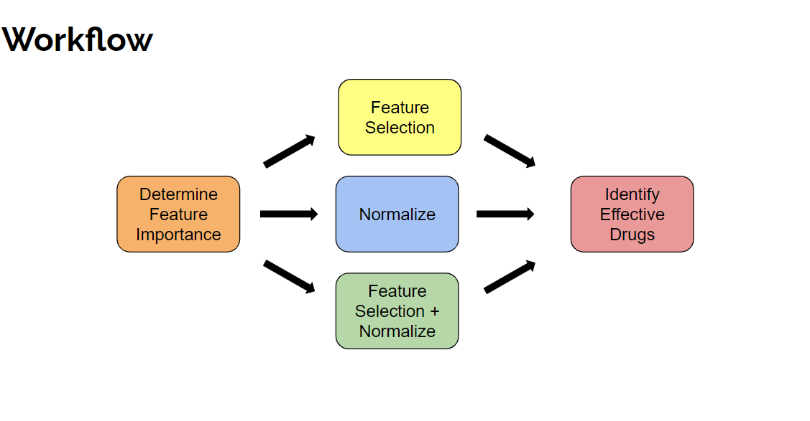
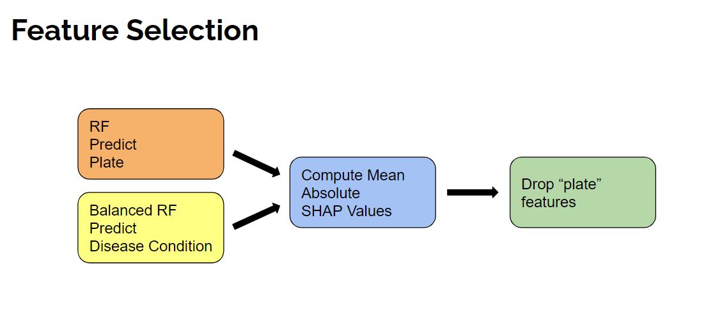

### Download the RxRx19a Data
Create a directory called 'data' in the home directory of the repo but running: `mkdir data`  

Go to [https://www.rxrx.ai/rxrx19a](https://www.rxrx.ai/rxrx19a), scroll to the bottom of the page, and download the "Metadata" and "Deep Learning Embeddings." Put these files (`metadata.csv` and `embeddings.csv`) into the `data` directory.

### Set up the Environment
Create a Python3 virtual environment and install the packages from the provided `requirements.txt` file.

This can be done by running the following commands:  
`python3 -m venv env`  
`source env/bin/activate`  
`python3 -m pip install -r requirements.txt`  

If that does not work, just make sure these packages are installed:  
```
pandas
numpy
imbalanced-learn
scikit-learn
matplotlib
shap
```

### Running the Pipeline
These scripts run using the SLURM Workload Manager. To perform these analyses without SLURM, you must replace `sbatch` with `bash` in all the bash scripts. When running with SLURM, you may need to adjust the bash scripts resource requests or other arguments. 

### Determine the Noise vs. Biological Signal in each Feature
Run this command to split the data by experiment and calculate SHAP values for each feature when predicting plate (batch effect/noise) vs disease condition (biological signal):  
`bash bash_scripts/split_n_get_shaps.sh data/embeddings.csv data/metadata.csv`  

If you want to normalize the deep learning embeddings to remove batch effects (we strongly recommend this) then add a final argument `n` when running, like so:  
`bash bash_scripts/split_n_get_shaps.sh data/embeddings.csv data/metadata.csv n`  

If you want to run with just feature dropping, instead add the argument `f`. If you want to use both, add `b` instead.

If feature dropping, run this command to view plots of the two SHAP values for each feature plotted against each other:  
`bash bash_scripts/run_shap_plots.sh`

Look at each experiments' plot to determine a cutoff for the disease condition shap that will remove the features that have small SHAP values for disease condition but have large shap values for plate. Record these four cut off values because we will use them in subsequent scripts.

### Ensure that Removing Noisy Features does not Remove Biological Signal
Run this command to perform a sensitivity test on each experiment except replace the four numbers with your determined SHAP cut off values for the HRCE-1, HRCE-2, VERO-1, and VERO-2 experiments, respectively. You can skip this step if you are only normalizing and not feature dropping.  
`bash bash_scripts/run_all_sensitivity_tests.sh 0.0002 0.0022 0.002 0.00015`

### Identify Potentially Effective Treatments
Run this command to identify treatments that might be effective against SARS-CoV-2, using two different methods:  
`bash bash_scripts/identify_effective_treatments.sh 0.0002 0.0022 0.002 0.00015`  

If you want to identify effective compounds without feature dropping, run the above script with all cutoffs as 0 like so:  
`bash bash_scripts/identify_effective_treatments.sh n`  

# Results

## Cosine Similarity vs RandomForest Predicted Probability

### HRCE-1 (Mock)
SHAP Value Cutoff: 0.0002

|Rank|Drug (Concentration)     |Cosine Similarity|Drug (Concentration)     |RandomForest Predicted Probability|
|----|-------------------------|-----------------|-------------------------|----------------------------------|
| 1  |Remdesivir (GS-5734) 0.3 |0.9942           |Remdesivir (GS-5734) 10.0|0.5558                            |
| 2  |GS-441524 10.0           |0.9903           |Quercetin 3.0            |0.4971                            |
| 3  |Remdesivir (GS-5734) 1.0 |0.9869           |Remdesivir (GS-5734) 3.0 |0.4567                            |
| 4  |budipine 3.0             |0.9742           |Pacritinib 1.0           |0.4446                            |
| 5  |Remdesivir (GS-5734) 3.0 |0.9737           |GS-441524 10.0           |0.4338                            |
| 6  |Quercetin 3.0            |0.9730           |Remdesivir (GS-5734) 0.3 |0.4021                            |
| 7  |GS-441524 3.0            |0.9701           |GS-441524 3.0            |0.3946                            |
| 8  |Remdesivir (GS-5734) 10.0|0.9685           |Remdesivir (GS-5734) 1.0 |0.3779                            |
| 9  |paricalcitol 0.01        |0.9670           |Aloxistatin 0.3          |0.3487                            |
|10  |Calcipotriene 0.3        |0.9668           |proscillaridin-a 0.01    |0.3462                            |
|11  |Aloxistatin 1.0          |0.9641           |narasin 0.3              |0.3362                            |
|12  |Cinnarizine 3.0          |0.9640           |narasin 1.0              |0.3346                            |
|13  |Darunavir 1.0            |0.9636           |Aloxistatin 10.0         |0.3333                            |
|14  |Calcipotriene 0.1        |0.9636           |Rapamycin 1.0            |0.3333                            |
|15  |Aloxistatin 0.1          |0.9612           |proscillaridin-a 0.03    |0.3329                            |
|16  |(R)-baclofen 0.01        |0.9602           |narasin 0.1              |0.3271                            |
|17  |paricalcitol 0.1         |0.9581           |Duvelisib 3.0            |0.3196                            |
|18  |Aloxistatin 0.3          |0.9557           |Gilteritinib 3.0         |0.3142                            |
|19  |Aloxistatin 10.0         |0.9551           |silmitasertib 3.0        |0.3067                            |
|20  |paricalcitol 0.03        |0.9523           |Zotarolimus 1.0          |0.2983                            |

### HRCE-2 (Mock)
SHAP Value Cutoff: 0.001

|Rank|Drug (Concentration)            |Cosine Similarity|Drug (Concentration)              |RandomForest Predicted Probability|
|----|--------------------------------|-----------------|----------------------------------|----------------------------------|
| 1  |trihexyphenidyl 3.0             |0.9889           |Remdesivir (GS-5734) 10.0         |0.3880                            |
| 2  |Remdesivir (GS-5734) 0.3        |0.9885           |clofazimine 0.3                   |0.3758                            |
| 3  |Remdesivir (GS-5734) 1.0        |0.9875           |Remdesivir (GS-5734) 0.3          |0.3520                            |
| 4  |celiprolol 0.1                  |0.9874           |Remdesivir (GS-5734) 3.0          |0.3380                            |
| 5  |GS-441524 3.0                   |0.9870           |Remdesivir (GS-5734) 1.0          |0.3295                            |
| 6  |Obeticholic acid 0.3            |0.9864           |abiraterone 3.0                   |0.3254                            |
| 7  |telmesteine 3.0                 |0.9854           |cloranolol 3.0                    |0.3212                            |
| 8  |GS-441524 10.0                  |0.9839           |GS-441524 3.0                     |0.3190                            |
| 9  |eperisone 3.0                   |0.9833           |digitoxin 0.03                    |0.3171                            |
|10  |carazolol 0.01                  |0.9830           |Mebendazole 1.0                   |0.3104                            |
|11  |Remdesivir (GS-5734) 3.0        |0.9825           |Aloxistatin 0.3                   |0.3005                            |
|12  |ISO-1 0.1                       |0.9821           |YK-4-279 3.0                      |0.3000                            |
|13  |Vismodegib 3.0                  |0.9820           |digoxin 0.3                       |0.2979                            |
|14  |Obeticholic acid 3.0            |0.9819           |salinomycin 0.03                  |0.2971                            |
|15  |Erythromycin ethylsuccinate 0.01|0.9817           |Indocyanine green 3.0             |0.2958                            |
|16  |Bromantane 3.0                  |0.9817           |Silodosin 3.0                     |0.2954                            |
|17  |alprenolol 0.1                  |0.9816           |Eravacycline (dihydrochloride) 3.0|0.2929                            |
|18  |Aloxistatin 0.3                 |0.9812           |bupranolol 0.03                   |0.2908                            |
|19  |Forodesine 3.0                  |0.9809           |Ponatinib 0.1                     |0.2883                            |
|20  |SIN-1 chloride 3.0              |0.9803           |Ciclopirox 3.0                    |0.2867                            |

### VERO-1 (Mock)
SHAP Value Cutoff: 0.001

|Rank|Drug (Concentration)           |Cosine Similarity|Drug (Concentration)            |RandomForest Predicted Probability|
|----|-------------------------------|-----------------|--------------------------------|----------------------------------|
| 1  |GS-441524 3.0                  |0.9836           |GS-441524 3.0                   |0.4944                            |
| 2  |GS-441524 10.0                 |0.9818           |GS-441524 10.0                  |0.4506                            |
| 3  |Remdesivir (GS-5734) 10.0      |0.9488           |Remdesivir (GS-5734) 10.0       |0.3281                            |
| 4  |Hydroxychloroquine Sulfate 10.0|0.7515           |Chloroquine 10.0                |0.2850                            |
| 5  |Chloroquine 3.0                |0.7446           |Hydroxychloroquine Sulfate 30.0 |0.2616                            |
| 6  |Chloroquine 10.0               |0.7114           |Chloroquine 30.0                |0.2594                            |
| 7  |solithromycin 10.0             |0.6778           |Hydroxychloroquine Sulfate 10.0 |0.2366                            |
| 8  |Imiquimod 10.0                 |0.6511           |Thymoquinone 10.0               |0.2056                            |
| 9  |Lopinavir 10.0                 |0.6038           |Pacritinib 10.0                 |0.1975                            |
|10  |GS-441524 1.0                  |0.6029           |Arbidol 10.0                    |0.1653                            |
|11  |solithromycin 3.0              |0.5920           |Pacritinib 3.0                  |0.1512                            |
|12  |Remdesivir (GS-5734) 3.0       |0.5850           |Thymoquinone 3.0                |0.1500                            |
|13  |Hydroxychloroquine Sulfate 30.0|0.5800           |Quinine 10.0                    |0.1469                            |
|14  |Chloroquine 30.0               |0.5612           |Hydroxychloroquine Sulfate 100.0|0.1434                            |
|15  |Ritonavir 10.0                 |0.5325           |Chloroquine 3.0                 |0.1409                            |
|16  |Hydroxychloroquine Sulfate 3.0 |0.5243           |Chloroquine 100.0               |0.1388                            |
|17  |Quinine 10.0                   |0.5174           |solithromycin 10.0              |0.0981                            |
|18  |Chloroquine 1.0                |0.5065           |ML-9 10.0                       |0.0853                            |
|19  |Thymoquinone 1.0               |0.4993           |Lopinavir 10.0                  |0.0816                            |
|20  |Aloxistatin 10.0               |0.4957           |Ritonavir 10.0                  |0.0722                            |

### VERO-2 (Mock)
SHAP Value Cutoff: 0.00125

|Rank|Drug (Concentration)           |Cosine Similarity|Drug (Concentration)            |RandomForest Predicted Probability|
|----|-------------------------------|-----------------|--------------------------------|----------------------------------|
| 1  |GS-441524 3.0                  |0.9898           |GS-441524 3.0                   |0.3825                            |
| 2  |GS-441524 10.0                 |0.9866           |Chloroquine 30.0                |0.3553                            |
| 3  |Hydroxychloroquine Sulfate 10.0|0.9406           |Hydroxychloroquine Sulfate 30.0 |0.3519                            |
| 4  |Chloroquine 10.0               |0.9366           |Chloroquine 10.0                |0.3512                            |
| 5  |Chloroquine 3.0                |0.8977           |Hydroxychloroquine Sulfate 10.0 |0.3181                            |
| 6  |Hydroxychloroquine Sulfate 3.0 |0.8292           |Arbidol 10.0                    |0.3062                            |
| 7  |Hydroxychloroquine Sulfate 30.0|0.8103           |GS-441524 10.0                  |0.3009                            |
| 8  |Quinine 10.0                   |0.8047           |Pacritinib 10.0                 |0.2950                            |
| 9  |Remdesivir (GS-5734) 10.0      |0.8028           |Thymoquinone 10.0               |0.2841                            |
|10  |solithromycin 10.0             |0.8007           |Chloroquine 3.0                 |0.2562                            |
|11  |Chloroquine 30.0               |0.7932           |Quinine 10.0                    |0.2394                            |
|12  |Lopinavir 10.0                 |0.7684           |Pacritinib 3.0                  |0.2231                            |
|13  |Chloroquine 1.0                |0.7633           |Hydroxychloroquine Sulfate 100.0|0.1966                            |
|14  |Arbidol 10.0                   |0.7567           |solithromycin 10.0              |0.1884                            |
|15  |GS-441524 1.0                  |0.7371           |Chloroquine 100.0               |0.1872                            |
|16  |Aloxistatin 3.0                |0.6163           |Remdesivir (GS-5734) 10.0       |0.1459                            |
|17  |Quinine 3.0                    |0.6041           |Hydroxychloroquine Sulfate 3.0  |0.1450                            |
|18  |ML-9 10.0                      |0.5757           |ML-9 10.0                       |0.0841                            |
|19  |Hydroxychloroquine Sulfate 1.0 |0.5638           |GS-441524 1.0                   |0.0806                            |
|20  |Cobicistat 10.0                |0.5599           |Chloroquine 1.0                 |0.0800                            |
